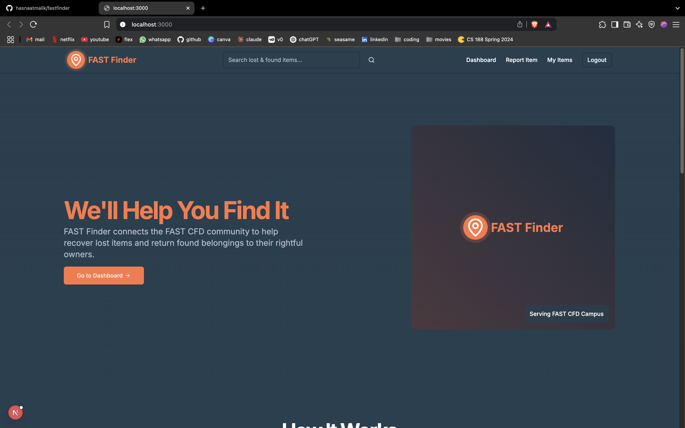

# FastFinder - Campus Lost & Found System

FastFinder is a web application designed to help the FAST CFD campus community manage lost and found items. The platform provides a centralized system where users can report lost items or items they've found, search through existing reports, and connect with others to recover their belongings.



## Features

- **User Authentication**

  - Registration with email verification
  - Secure login with JWT
  - Password reset functionality

- **Item Management**

  - Report lost items with detailed information
  - Report found items
  - Upload images of items
  - Update item status (open/closed)

- **Search and Discovery**

  - Search for items by keywords
  - Filter by category, type (lost/found), status, and location
  - Browse all reported items

- **User Dashboard**
  - View all reported items
  - Filter personal reports
  - Manage item status

## Technologies Used

- **Frontend**

  - Next.js 14 (App Router)
  - TypeScript
  - Tailwind CSS
  - shadcn/ui components
  - React Hook Form

- **Backend**
  - Next.js API Routes
  - MongoDB with Mongoose
  - JWT Authentication
  - Nodemailer

## Prerequisites

Before you begin, ensure you have the following installed:

- Node.js (v18 or higher)
- npm or yarn
- MongoDB (local instance or MongoDB Atlas account)

## Installation

1. Clone the repository:
   ```bash
   git clone https://github.com/hasnaatmalik/fastfinder
   cd fastfinder
   ```
